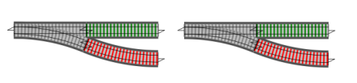

- title : Monads are not Burritos
- description : Explaining monads to the uninitiated
- author : Marcus Griep
- theme : League
- transition : default

***

# Monads are not Burritos

## Explaining monads to the uninitiated

Marcus Griep 
[@neoeinstein](https://twitter.com/neoeinstein)

' So, we've all had it happen. We've been going along having a lot of fun
' playing around with functional languages. We've learned all sorts of new
' concepts. Maybe we've even gotten a few things working Haskell. Suddenly,

***

' your friend, co-worker, or partner asks you about this functional programming
' thing that you've been doing. So, you quickly pull up your latest project and

***

' start to show them all of the cool things that you've been learning. You point
' out all the major selling points of functional languages: immutability, freedom
' from side-effects, and how you're able to leverage these properties to reason about
' larger programs composed of smaller parts.

---

' You're showing them this beautiful world.

---

<code>>>=</code>

<code>Option.bind</code>

<code>m-bind</code>

' Then you stumble across a bind operator

---

<code>do</code> & <code><-</code>

<code>maybe {}</code> & <code>let!</code>

<code>domonad</code>

' Or, more likely you come across some syntactic sugar provided by the
' language you're using, and your friend wonders "What's that?"

***

<pre>
<pre style="font-size:150%">
Your friend asks "What does that do?"
</pre>

<pre style="font-size:150%" class="fragment">
Your choices:
    1. Oh, that's the Maybe monad!
</pre>

<pre style="font-size:150%" class="fragment">
Your answer: 1
</pre>
</pre>

' All too often we are equipped with only one answer.

---

' The reply: What's a monad?
' Congratulations, you've already lost them. Your attempts to reel them back in
' with casual mentions of category theory will certainly be entertaining. You
' might even try to explain that a monad is a container, a wrapper, or a burrito.

---

# Game Over

' But, none of this will persuade them that they understand you.
' At this point throwing "A monad is a monoid in the category of endofunctors"
' on to the fire probably won't do any more harm.
' Ok. so that didn't go so great. Let's go back and see if there are any other
' options.

***

<pre>
<pre style="font-size:150%">
Your friend asks "What does that do?"
</pre>

<pre style="font-size:150%">
Your choices:
    1. Oh, that's the Maybe monad!
    2. It chains together two functions
       that may or may not produce
       a value.
</pre>

<pre style="font-size:150%">
Your answer: 2
</pre>
</pre>

' From here, your friend is probably responding with an uncertain "oh..."
' But now, you can continue. "Here, let me show you.

---

' See, these two functions both take a value and return a maybe. Remember how
' I mentioned that Maybe is a type that holds either Just a value or Nothing?
' We want to chain these functions together, but if the first function produces
' Nothing, then there is no good value to feed into the second function. Instead
' we want it to pass along the Nothing. If the first function did produce a value,
' though, we want to pass that result into the second function."
' (Images sourced from fsharpforfunandprofit.com)

---

' "The bind operation is the glue which chains these two operations together.
' We can also do something similar with Either (Result/Choice)."
' Now the conversation is going somewhere productive, and you haven't even mentioned
' monads, applicatives, or functors. It is inevitable that they will be exposed to
' these concepts, but if properly framed, we can accelerate their ability to
' wrap their heads around them.

---

### Monad and Applicative in Elm

Monadic `bind` / `>>=`

    [code=elm]
    postTime : (Time -> String) -> Task Http.Error String
    postTime resourceUrl =
      Time.now `Task.andThen` (resourceUrl >> Http.getString)

Applicative `apply` / `<*>`

    [code=elm]
    tryMkPerson : Maybe String -> Maybe Int -> Maybe Person
    tryMkPerson name age =
      Person `Maybe.map` name `Maybe.andMap` age

' Elm, is a pure, functional language that transpiles to Javascript. Its target audience is
' developers who are moving over from a highly imperative world and who have no prior exposure
' to many of these functional concepts. Starting from that point, Elm explicitly avoids using
' the names `bind` and `apply`, instead preferring to use `andThen` and `andMap`. And, while
' you will find the words Monad and Applicative in the documentation, those terms are merely
' pointed out as "the patterns that more experienced functional programmers will know by another
' name.

***

<dl>
<dt class="fragment" data-fragment-index="1">Reader</dt>
<dd class="fragment" data-fragment-index="2">Chains an argument or environment through a computation to produce a value</dd>
<dt class="fragment" data-fragment-index="3">State</dt>
<dd class="fragment" data-fragment-index="4">Mimics mutation by threading a state through a computation to produce a value</dd>
<dt class="fragment" data-fragment-index="5">IO</dt>
<dd class="fragment" data-fragment-index="6">Chains together the intent to perform certain effects as part of a computation to produce a value, delaying the effects until they are later executed</dd>
</dl>

<em>Monad is the pattern</em>

' As you go along and explain types like Reader, State, and IO, point out
' the similar patterns for how you interact with them. Humans are much better
' at starting from concrete examples and generalizing to abstract concepts
' than going the other way around. Even the Haskellbook waits until 750 pages
' into Haskell before tackling Monads and that is only after it has laid down
' layers of foundation and subtle exposure to monads.

---

## So what is a monad?

> A monad is a structure that defines how to chain its operations together
> so that those operations compose sanely.

***

## Three easy steps

<ol>
<li class="fragment">Don't start with "Oh! That's a monad!"</li>
<li class="fragment">Focus on explaining concrete examples</li>
<li class="fragment">Name the pattern as it emerges</li>
</ol>

' Remember, you didn't start explaining lists by saying "Oh, that's the list monad!"